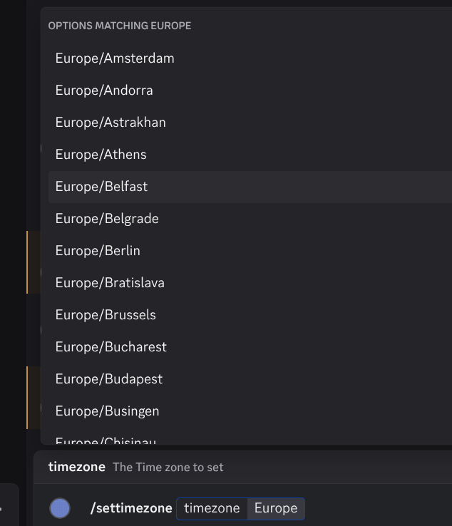
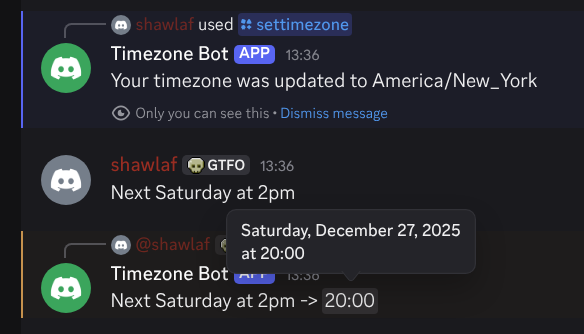

# Timezone Bot

Discord4J Bot for automatically converting Times in natural language to discord time stamps using [natty](https://natty-parser.github.io/)

## Usage

Selecting a timezone: `/settimezone` Command

This is needed for the Bot to properly handle relative times:

When a timezone is set and you write a Chat Message containing a Time parsed by natty, the Bot will reply with a discord-formatted timestamp

# Building

Run `mvn package`
